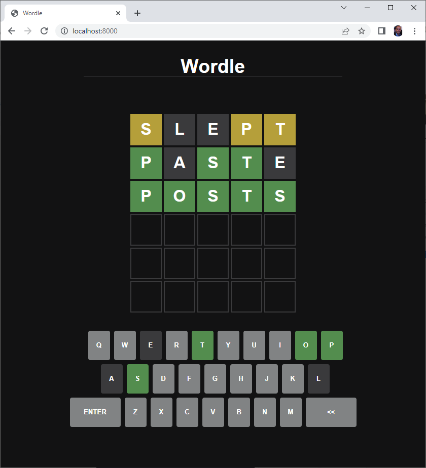

#Wordle Microservice

Recreation of the popular Wordle game consisting of:

Word Service - Spring Boot Application Microservice with Rest API for random word retrieval and word validation, includes Unit and Integration Tests
Wordle Javascript application via Node JS Server

